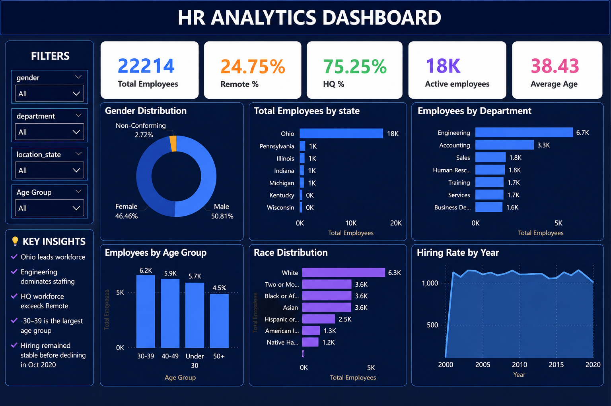

HR Analytics Dashboard | SQL & Power BI

📊 Project Overview

Developed an interactive HR Analytics Dashboard using SQL and Power BI to analyze workforce data for over 22,000 employees.

The project focuses on workforce composition, hiring patterns, employee demographics, department distribution, geographic distribution, and work arrangements.

💼 Business Problem

Organizations need a clear view of their workforce to understand employee distribution, hiring patterns, demographics, departments, locations, and work arrangements.

This project transforms HR data into meaningful insights that can support workforce planning and data-driven HR decision-making.

🎯 Project Objectives

* Analyze overall workforce size and employee status
* Monitor active employees
* Analyze hiring trends over time
* Understand employee distribution across departments
* Analyze workforce distribution by state
* Analyze gender and race demographics
* Compare remote and headquarters-based employees
* Generate actionable insights for workforce planning

🛠️ Tools & Technologies

* SQL
* Power BI
* Power Query
* DAX

🗄️ SQL Analysis

SQL was used to query, filter, and prepare HR data for analysis before importing the data into Power BI.

The prepared data was then used for further transformation, analysis, KPI creation, and visualization in Power BI.

🔄 Data Preparation & Analysis

1. Queried and filtered HR data using SQL.
2. Prepared the data for analysis.
3. Imported the prepared data into Power BI.
4. Performed data transformation using Power Query.
5. Created DAX calculations for KPIs and analysis.
6. Built interactive Power BI visualizations.
7. Generated business insights from the dashboard.

📌 Key KPIs

| KPI                  |       Value |
| -------------------- | ----------: |
| Total Employees      |      22,214 |
| Active Employees     |     ~18,000 |
| Average Employee Age | 38.43 years |
| Remote Work          |      24.75% |
| Headquarters Work    |      75.25% |

📊 Dashboard Preview

📈 Dashboard Analysis

The dashboard provides analysis of:

* Hiring trends by year
* Employees by department
* Employees by state
* Employee distribution by gender
* Employee distribution by race
* Remote vs Headquarters workforce
* Workforce KPIs

🔍 Key Insights

* The organization has a workforce of 22,214 employees.
* Approximately 18,000 employees are currently active.
* 24.75% of employees work remotely.
* 75.25% of employees work from headquarters.
* The average employee age is 38.43 years.
* Engineering is the largest department.
* Ohio has the highest employee concentration.
* Gender representation is relatively balanced.
* The workforce includes representation across multiple racial groups.

💡 Business Value

The dashboard converts HR workforce data into actionable insights that can support:

* Workforce planning
* Recruitment strategy
* Employee demographics analysis
* Remote-work planning
* Department-level workforce planning
* Diversity and inclusion analysis
* Data-driven HR decision-making

📂 Project Files

| Folder       | Description                     |
| ------------ | ------------------------------- |
| PowerBI      | Power BI dashboard file (.pbix) |
| Presentation | Project presentation (.pptx)    |
| Report       | Detailed project report (.docx) |
| Screenshots  | Dashboard preview images        |

👤 Author

R. Prasanth Kumar Reddy

Data Analytics | SQL | Power BI | DAX
