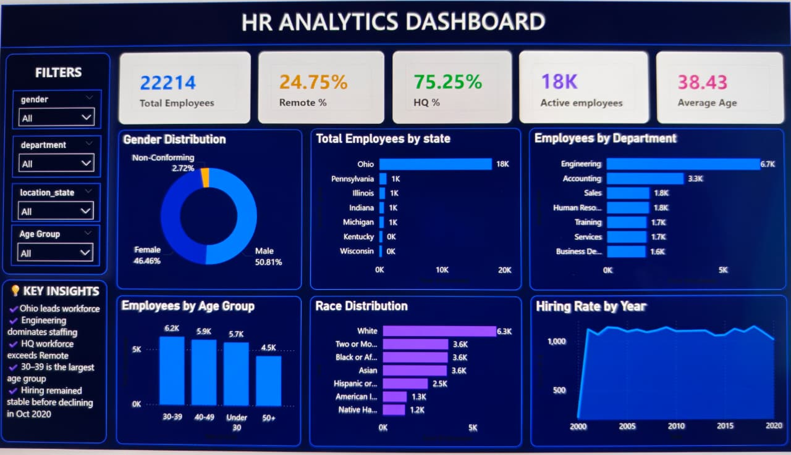

HR Analytics Dashboard | SQL & Power BI

📊 Project Overview

Developed an interactive HR Analytics Dashboard using SQL and Power BI to analyze workforce data for over 22,000 employees.

The dashboard provides insights into workforce demographics, hiring trends, departments, states, age groups, gender, race, and work arrangements.

🛠️ Tools & Technologies

- SQL
- Power BI
- Power Query
- DAX

📌 Key KPIs

| KPI | Value |
|---|---:|
| Total Employees | 22,214 |
| Active Employees | 18K |
| Average Employee Age | 38.43 |
| Remote Work | 24.75% |
| Headquarters Work | 75.25% |

📊 Dashboard Preview

📈 Dashboard Analysis

- Hiring Rate by Year
- Employees by Department
- Employees by State
- Gender Distribution
- Race Distribution
- Employees by Age Group
- Remote vs Headquarters Workforce

🔍 Key Insights

- Ohio has the highest employee concentration.
- Engineering is the largest department.
- The 30–39 age group is the largest.
- Headquarters employees significantly exceed remote employees.
- Male and female representation is relatively balanced.
- Hiring activity remained relatively stable before declining toward 2020.

📂 Project Files

- PowerBI/ — Power BI dashboard
- Presentation/ — Project presentation
- Report/ — Project report
- Screenshots/ — Dashboard screenshot

👤 Author

R. Prasanth Kumar Reddy

Data Analytics | SQL | Power BI | DAX
